<div align="center">

<br>

# Jobbly

**A modern job recruitment platform connecting talent with opportunity**

Built with Flutter, Supabase, and a hybrid caching architecture for seamless offline-first experiences.

<br>


[**Get Started →**](#getting-started)


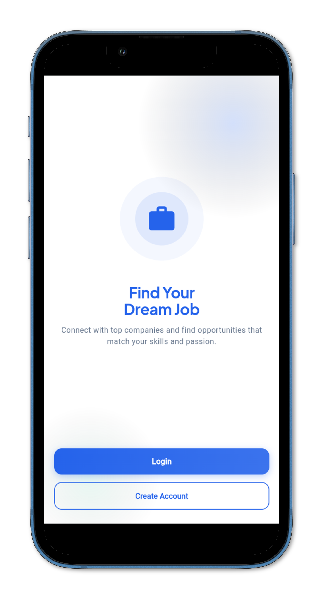

</div>


## Overview

Jobbly is a dual-sided recruitment platform where **job seekers** discover opportunities matched to their skills, and **companies** find qualified candidates through intelligent matching and skill assessments.


### Core Concepts

| Concept | Description |
|---------|-------------|
| **Skill Matching Algorithm** | Computes seeker-job compatibility using set intersection - matching skills divided by required skills, sorted by percentage then recency for ranked recommendations |
| **Timed Quiz Engine** | Real-time countdown with color-coded urgency states, question navigation dots showing answered status, and auto-submit on timeout with partial completion handling |
| **Offline-First Architecture** | Hive boxes initialize before Supabase, serving cached data instantly while background sync updates from remote - writes go Supabase → Hive → UI for consistency |
| **Graceful Session Recovery** | Auth listener handles token refresh failures, expired sessions, and stale state with automatic signout fallback and local-only cleanup on account deletion |

<br>

## Preview

<div align="center">
<table>
<tr>
<td>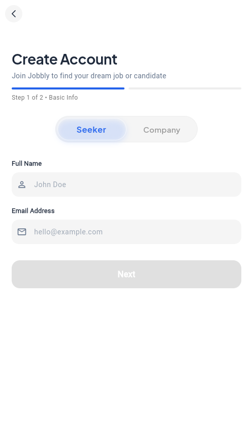</td>
<td>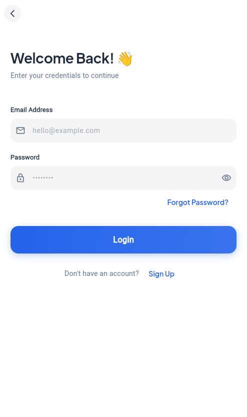</td>
<td>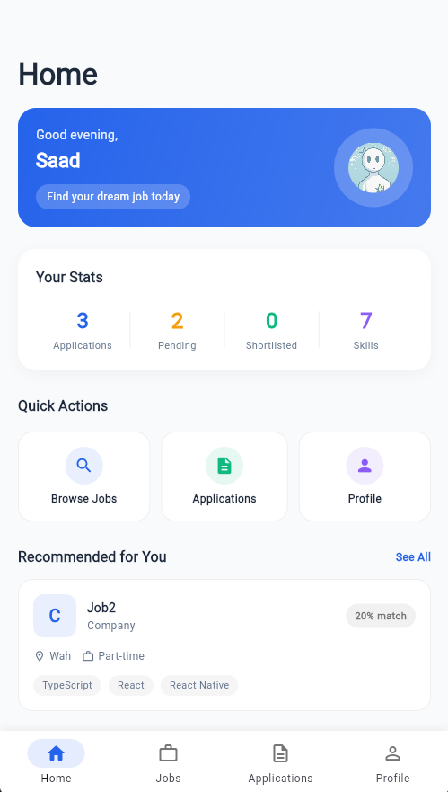</td>
<td>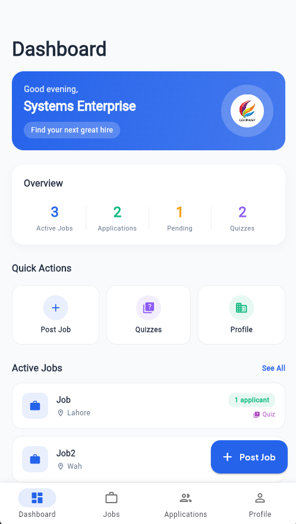</td>
</tr>
<tr>
<td align="center"><sub>Signup</sub></td>
<td align="center"><sub>Authentication</sub></td>
<td align="center"><sub>Seeker Dashboard</sub></td>
<td align="center"><sub>Company Dashboard</sub></td>
</tr>
</table>

<table>
<tr>
<td>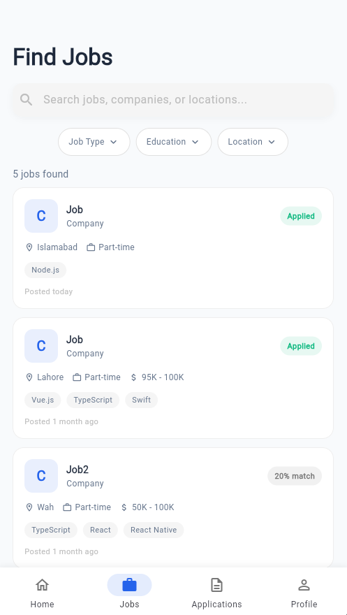</td>
<td>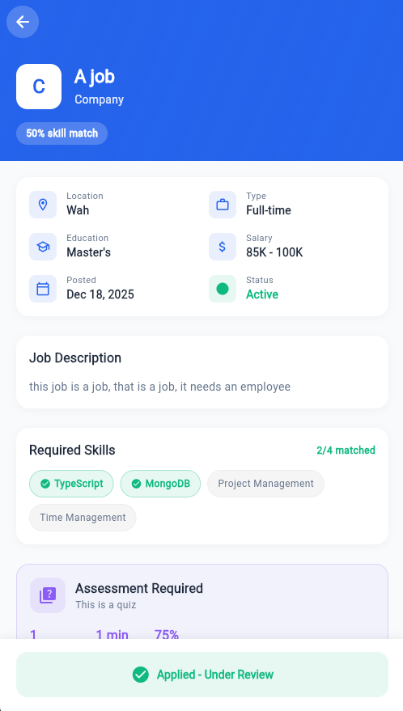</td>
<td>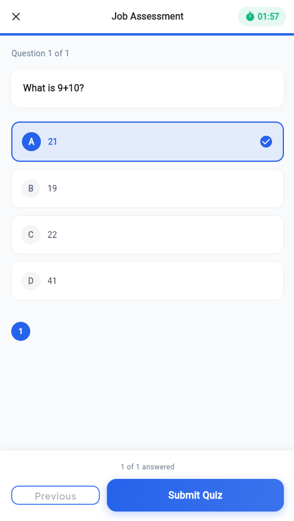</td>
<td>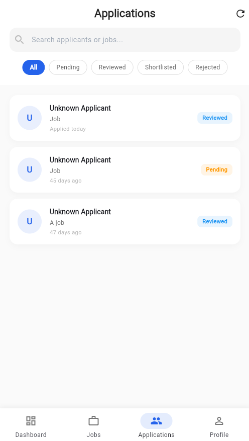</td>
</tr>
<tr>
<td align="center"><sub>Job Listings</sub></td>
<td align="center"><sub>Job Details</sub></td>
<td align="center"><sub>Skill Assessment</sub></td>
<td align="center"><sub>Applications</sub></td>
</tr>
</table>
</div>

<br>

## Architecture

### Data Flow

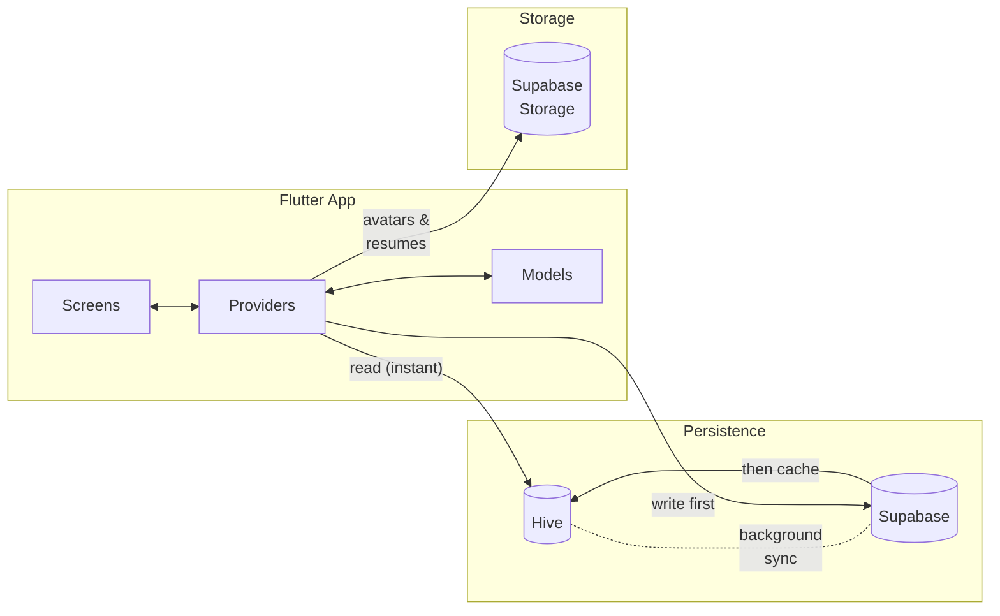

### Hybrid Caching Strategy

The app implements a **Supabase-first, Hive-cache** pattern:

```dart
// On write: Supabase → Hive → UI
Future<Job> addJob(Map<String, dynamic> jobData) async {
  // 1. Persist to Supabase (source of truth)
  final response = await _supabase.from('jobs').insert(jobData).select().single();
  final job = Job.fromMap(response);
  
  // 2. Cache locally in Hive
  await _jobBox.put(job.jobId, job.toMap());
  
  // 3. Update state and notify listeners
  _jobs.add(job);
  notifyListeners();
  return job;
}

// On read: Hive first (instant), then background sync
Future<void> init() async {
  getAllJobs();                        // Load from Hive cache immediately
  await fetchAllJobsFromSupabase();    // Sync with remote in background
}
```

This ensures:
- **Instant UI** - Cached data loads immediately on app start
- **Offline resilience** - App remains functional without network
- **Data consistency** - Remote sync keeps cache up-to-date

<br>

---

<br>

## Features

### For Job Seekers

- **Smart Job Discovery** - Browse listings with skill-based match percentages
- **One-Click Applications** - Apply instantly and track status in real-time
- **Timed Skill Assessments** - Take quizzes with countdown timer and auto-submit
- **Profile Builder** - Upload resume, add skills, education, and work experience
- **Application Tracking** - Monitor pending, reviewed, shortlisted, and rejected applications

### For Companies

- **Job Posting** - Create listings with salary ranges, job types, and required skills
- **Quiz Builder** - Design multiple-choice assessments with custom duration and passing scores
- **Applicant Management** - Review profiles, quiz scores, resumes, and update application status
- **Dashboard Analytics** - Track active jobs, total applications, and pending reviews

### Shared

- **Email Verification** - Secure signup flow with deep link redirect after verification
- **Guided Onboarding** - Step-by-step profile setup for new users
- **Session Management** - Auto-refresh tokens with graceful handling of expired sessions
- **Pull-to-Refresh** - Sync latest data from server on any list screen

<br>

---

<br>

## Tech Stack

| Layer | Technology |
|-------|------------|
| Framework | Flutter 3.9+ with Material 3 |
| Language | Dart 3.9+ |
| Backend | Supabase (Auth, PostgreSQL, Storage) |
| State | Provider (ChangeNotifier pattern) |
| Cache | Hive (NoSQL boxes per entity) |
| Animations | flutter_animate |
| Typography | Plus Jakarta Sans, Inter |

<details>
<summary>Full dependency list</summary>

```yaml
dependencies:
  # Backend & Auth
  supabase_flutter: ^2.10.3
  flutter_dotenv: ^5.2.1
  
  # State Management
  provider: ^6.1.5+1
  
  # Local Storage
  hive_flutter: ^1.1.0
  
  # UI & Animation
  flutter_animate: ^4.5.2
  animations: ^2.0.11
  page_transition: ^2.2.1
  animated_toggle_switch: ^0.8.5
  flutter_custom_clippers: ^2.1.0
  google_fonts: ^6.3.2
  
  # Utilities
  image_picker: ^1.1.2
  file_picker: ^8.0.0+1
  url_launcher: ^6.2.5
  app_links: ^6.3.2
```

</details>

<br>

---

<br>

## Database Schema

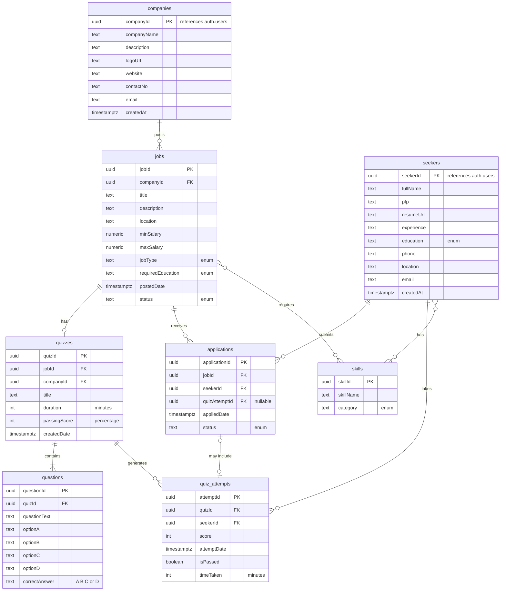

> **Junction Tables:** `job_skills` (jobId, skillId) and `seeker_skills` (seekerId, skillId, proficiencyLevel)  
> **Auth:** `companyId` and `seekerId` reference `auth.users(id)` with `ON DELETE CASCADE`  
> **Security:** All tables enforce Row Level Security (RLS) with ownership-based policies

<br>

---

<br>

## Getting Started

### Prerequisites

- Flutter SDK `^3.9.2`
- Dart SDK `^3.9.2`
- Supabase project

### Installation

```bash
# Clone repository
git clone https://github.com/BrAtUkA/Jobbly.git
cd Jobbly

# Create environment file
echo "SUPABASE_URL=your_url" > .env
echo "SUPABASE_ANON_KEY=your_key" >> .env

# Install dependencies
flutter pub get

# Run
flutter run
```

### Supabase Setup

1. **Create a Supabase project** at [supabase.com](https://supabase.com)

2. **Create storage buckets** - Go to Storage and create these (set both as **public**):
   - `avatars` - for profile pictures
   - `resumes` - for seeker resumes

3. **Run the SQL setup** - Go to SQL Editor and run the contents of:
   ```
   supabase_setup.sql
   ```
   This creates all tables, RLS policies, triggers, functions, and storage policies.

4. **Verify Auth settings** - In Authentication → Providers:
   - Email provider should be enabled (default)
   - Set Site URL to your app's redirect URL

<br>


<br>

## Project Structure

```
lib/
├── main.dart                 # Entry point, providers, routing
├── models/                   # Data classes with toMap/fromMap
│   ├── user.dart            
│   ├── company.dart          # extends User
│   ├── seeker.dart           # extends User
│   ├── job.dart
│   ├── application.dart
│   ├── quiz.dart
│   └── enums/                # UserType, JobType, ApplicationStatus, etc.
├── providers/                # ChangeNotifier classes
│   ├── auth_provider.dart    # Supabase auth + session handling
│   ├── job_provider.dart     # CRUD with Hive caching
│   └── ...
├── screens/
│   ├── auth/                 # Welcome, Login, Signup, Forgot Password
│   ├── onboarding/           # Company & Seeker setup flows
│   ├── company/              # Dashboard, Jobs, Applications, Create screens
│   ├── seeker/               # Dashboard, Listings, Detail, Quiz, Profile
│   └── shared/               # Settings
├── services/
│   └── storage_service.dart  # Avatar & resume upload handling
├── theme/
│   └── app_theme.dart        # Colors, typography, component themes
├── utils/
│   ├── constants.dart        # Environment variables
│   ├── validators.dart       # Form validation
│   └── dialogs.dart          # Reusable dialogs
└── widgets/
    ├── common/               # Shared UI components
    ├── dashboard/            # Stat cards, welcome cards
    └── primary_button.dart
```

<br>


<br>

## Design System

| Token | Value | Usage |
|-------|-------|-------|
| Primary | `#2563EB` | Actions, links, focus states |
| Secondary | `#10B981` | Success, positive indicators |
| Accent | `#F59E0B` | Highlights, warnings |
| Background | `#F8FAFC` | Page backgrounds |
| Error | `#EF4444` | Validation, destructive actions |
| Text Primary | `#1E293B` | Headings, body |
| Text Secondary | `#64748B` | Captions, placeholders |

**Typography:** Plus Jakarta Sans (headings) / Inter (body)  
**Corner Radius:** 14px (inputs) / 16px (buttons, cards)  
**Shadows:** Minimal, using subtle elevation

<br>


---
<p align="center">
  <sub>Semester Project - Jobbly</sub>
  <br>
  <sub>Fall 2025</sub>
</p>
